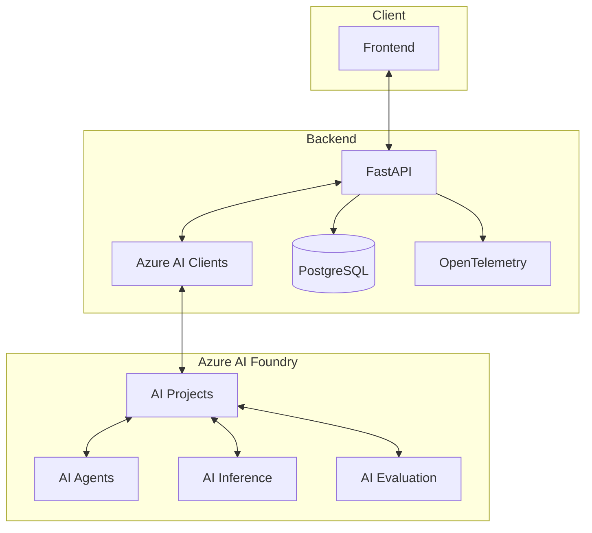
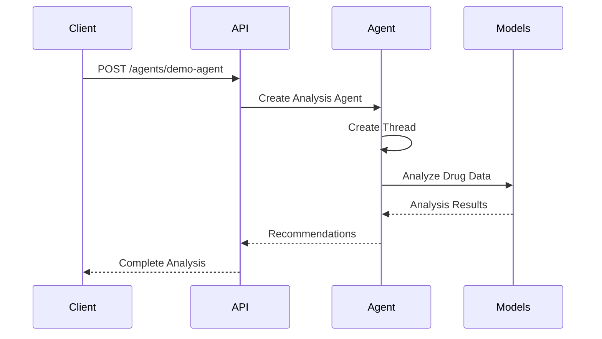
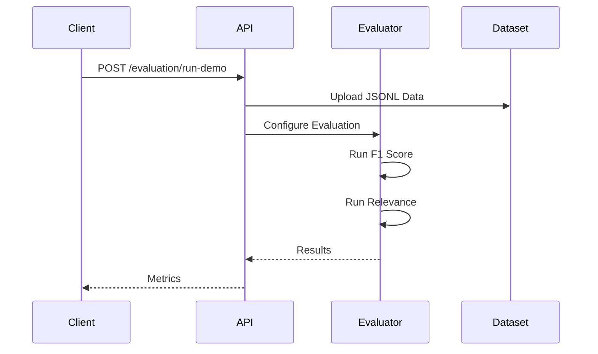
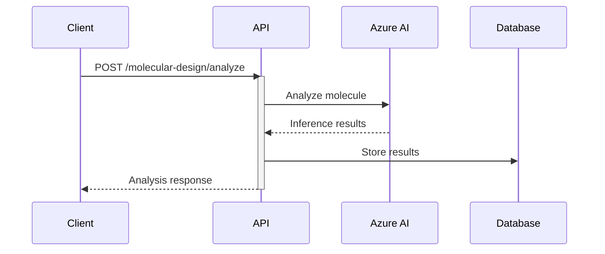

# Drug Development Platform Backend 🧬

## Overview 🎯
FastAPI backend for the Drug Development Platform, leveraging Azure AI Foundry SDKs for molecular analysis and clinical trial monitoring.

## Azure AI Integration 🤖

### SDKs Used
- 🎯 **azure-ai-projects**: Project and agent management
  ```python
  # main.py
  project_client = AIProjectClient.from_connection_string(
      credential=credential,
      conn_str=PROJECT_CONNECTION_STRING
  )
  ```

- 🔬 **azure-ai-inference**: Molecular analysis and predictions
  ```python
  # molecular_design.py
  inference_client = project_client.inference.get_chat_completions_client()
  ```

- 📊 **azure-ai-evaluation**: Result analysis and confidence scoring
  ```python
  # automated_testing.py
  evaluation = Evaluation(
      display_name="Drug Analysis Evaluation",
      description="Evaluation of drug analysis outputs",
      data=Dataset(id=data_id),
      evaluators={
          "f1_score": EvaluatorConfiguration(id=F1ScoreEvaluator.id),
          "relevance": EvaluatorConfiguration(id=RelevanceEvaluator.id)
      }
  )
  ```

- 📈 **opentelemetry-sdk**: Performance monitoring and tracing
  ```python
  # main.py
  trace.set_tracer_provider(TracerProvider())
  tracer = trace.get_tracer(__name__)
  ```

- 🔐 **azure-identity**: Secure Azure authentication
  ```python
  # main.py
  credential = DefaultAzureCredential()
  ```

## Getting Started 🚀

1. **Create Virtual Environment**:
   ```bash
   python -m venv venv
   source venv/bin/activate  # Windows: venv\Scripts\activate
   ```

2. **Install Dependencies**:
   ```bash
   pip install -r requirements.txt
   ```

3. **Configure Environment**:
   - Copy `.env.example` to `.env`
   - Update with your Azure credentials:
   ```env
   # Azure Authentication (DO NOT commit actual values!)
   AZURE_CLIENT_ID=your_client_id_here
   AZURE_CLIENT_SECRET=your_client_secret_here
   AZURE_TENANT_ID=your_tenant_id_here
   
   # AI Foundry Configuration (use your project-specific values)
   PROJECT_CONNECTION_STRING=your_connection_string_here
   MODEL_DEPLOYMENT_NAME=your_model_name_here
   
   # OpenTelemetry Settings (adjust based on your environment)
   OTEL_EXPORTER_OTLP_ENDPOINT=http://localhost:4318
   OTEL_SERVICE_NAME=your_service_name_here
   OTEL_RESOURCE_ATTRIBUTES=deployment.environment=your_env_here
   ```

   > ⚠️ **Security Note**: Never commit real credentials or sensitive information to version control.
   > Always use environment variables or secure secret management solutions in production.

   Required Environment Variables:
   - `AZURE_CLIENT_ID`: Azure AD application ID
   - `AZURE_CLIENT_SECRET`: Azure AD application secret
   - `AZURE_TENANT_ID`: Azure AD tenant ID
   - `PROJECT_CONNECTION_STRING`: AI Foundry project connection string
   - `MODEL_DEPLOYMENT_NAME`: Name of your deployed model
   - `OTEL_EXPORTER_OTLP_ENDPOINT`: OpenTelemetry collector endpoint
   - `OTEL_SERVICE_NAME`: Service name for tracing
   - `OTEL_RESOURCE_ATTRIBUTES`: Additional tracing attributes

4. **Run the Server**:
   ```bash
   uvicorn main:app --reload
   ```

5. **Access API Documentation**:
   - OpenAPI: [http://localhost:8000/docs](http://localhost:8000/docs)
   - ReDoc: [http://localhost:8000/redoc](http://localhost:8000/redoc)

## API Architecture 🏗️



## Endpoints 🛠️

### Molecular Design Endpoints

#### 1. Analyze Molecule
```bash
POST /molecular-design/analyze
```
Analyzes a drug candidate's molecular properties using Azure AI Inference.

Request:
```json
{
    "id": "DRUG-001",
    "molecule_type": "Small Molecule",
    "therapeutic_area": "Oncology",
    "target_proteins": ["EGFR", "HER2"],
    "development_stage": "Phase 1"
}
```

Response:
```json
{
    "message": "Molecular analysis complete",
    "analysis": {
        "efficacy_score": 0.85,
        "safety_score": 0.92,
        "confidence": 0.89
    }
}
```

#### 2. AI Agent Analysis
```bash
POST /agents/demo-agent
```
Uses Azure AI Foundry agents to perform comprehensive drug analysis.



Request:
```json
{
    "id": "DRUG-002",
    "molecule_type": "Antibody",
    "therapeutic_area": "Immunology",
    "target_proteins": ["CD20"],
    "development_stage": "Preclinical"
}
```

Response:
```json
{
    "message": "Agent analysis complete",
    "molecule_id": "DRUG-002",
    "analysis": "Detailed molecular analysis...",
    "recommendations": [
        "Continue with detailed toxicology studies",
        "Consider additional protein binding assays",
        "Monitor for specific side effects"
    ]
}
```

### Clinical Trials Endpoints

#### 1. Monitor Trials
```bash
GET /clinical-trials/monitor?trial_id=TRIAL-001
```
Real-time monitoring of clinical trial metrics and patient responses.

Response:
```json
{
    "trial_id": "TRIAL-001",
    "phase": "Phase 2",
    "status": "Active",
    "real_time_metrics": {
        "enrollment_rate": 0.75,
        "retention_rate": 0.92,
        "safety_signals": []
    }
}
```

#### 2. Predict Patient Response
```bash
POST /clinical-trials/predict-response
```
Predicts individual patient response using biomarker analysis.

Request:
```json
{
    "trial_id": "TRIAL-001",
    "patient_id": "PAT-001"
}
```

Response:
```json
{
    "predicted_response": 0.85,
    "confidence": 0.92,
    "recommendations": [
        "Continue monitoring key biomarkers",
        "Schedule follow-up in 2 weeks"
    ]
}
```

### Automated Testing Endpoints

#### 1. Run Evaluation Demo



## OpenTelemetry Integration 📊

This project uses OpenTelemetry for distributed tracing to monitor and debug the drug development pipeline. Traces help us understand:

- 🔍 Performance bottlenecks
- 🔗 Request flows through the system
- ❌ Error patterns and their context
- 📈 AI model inference timing

### Viewing Traces

1. Traces are collected by the OpenTelemetry collector at:
   ```
   http://localhost:4318/v1/traces
   ```

2. Key spans to monitor:
   - `molecular_design.analyze`: Molecule analysis and AI inference
   - `clinical_trials.monitor`: Trial monitoring and metrics
   - `clinical_trials.predict_response`: Patient response predictions

3. Important attributes in traces:
   - `molecule.id`: Unique identifier for drug candidates
   - `molecule.type`: Type of molecule being analyzed
   - `therapeutic.area`: Target therapeutic area
   - `analysis.efficacy`: Predicted efficacy score
   - `analysis.safety`: Safety assessment score
   - `trial.id`: Clinical trial identifier
   - `patient.id`: Patient identifier for specific analyses

### Example Trace Analysis



## Security 🔒

1. **Environment Variables**:
   - All secrets stored in `.env`
   - Never commit sensitive data

2. **Authentication**:
   - Azure AD integration
   - Role-based access control

3. **Data Protection**:
   - Encryption at rest
   - Secure communication

## Contributing 🤝
1. Fork the repository
2. Create a feature branch
3. Submit a Pull Request

```bash
POST /evaluation/run-demo
```
Demonstrates Azure AI Evaluation capabilities using sample drug analysis data.

Response:
```json
{
    "message": "Evaluation started",
    "evaluation_id": "eval-123",
    "status": "in_progress",
    "metrics": [
        "F1 Score - Measuring output accuracy",
        "Relevance Score - Assessing response quality"
    ]
}
```

### Supply Chain Endpoints

#### 1. Predict Demand
```bash
GET /supply-chain/predict-demand?therapeutic_area=Oncology&timeframe_days=90
```
Predicts drug demand using historical data and market trends.

Response:
```json
{
    "current_demand": 1000,
    "predicted_demand": 1150,
    "confidence_score": 0.85,
    "factors": {
        "active_trials": 5,
        "growth_rate": 0.15,
        "market_trends": [
            "Increasing demand in oncology",
            "Stable demand in cardiovascular"
        ]
    }
}
```

## Learn More 📚
- [Azure AI Projects SDK](https://learn.microsoft.com/python/api/overview/azure/ai-projects-readme?view=azure-python-preview)
- [Azure AI Inference SDK](https://learn.microsoft.com/python/api/overview/azure/ai-inference-readme?view=azure-python-preview)
- [Azure AI Evaluation SDK](https://learn.microsoft.com/python/api/overview/azure/ai-evaluation-readme?view=azure-python-preview)
- [OpenTelemetry Documentation](https://opentelemetry.io/docs/)
- [FastAPI Documentation](https://fastapi.tiangolo.com/)
