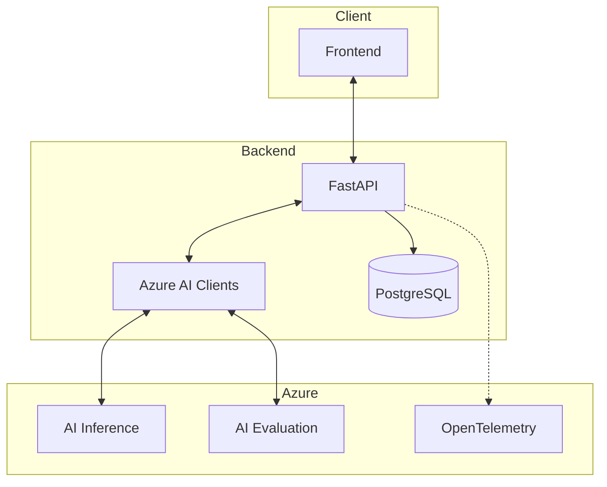
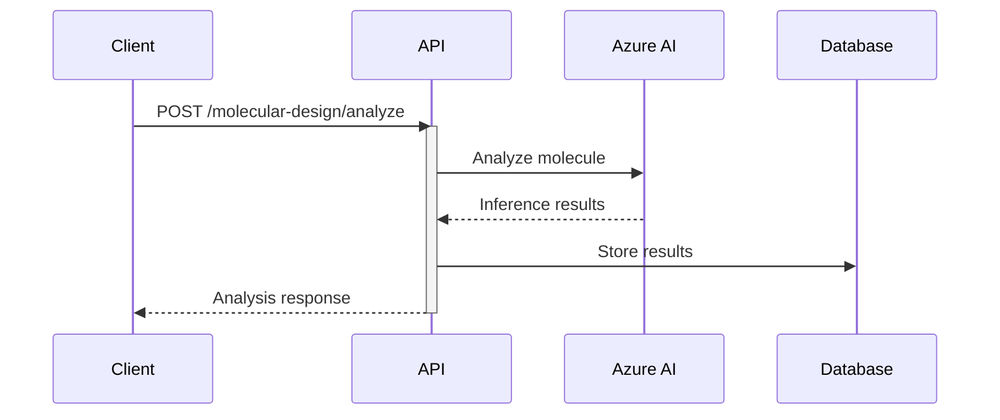

# Drug Development Platform Backend 🧬

## Overview 🎯
FastAPI backend for the Drug Development Platform, leveraging Azure AI Foundry SDKs for molecular analysis and clinical trial monitoring.

## Azure AI Integration 🤖

### SDKs Used
- 🔬 **azure-ai-inference**: Molecular analysis and predictions
  ```python
  # molecular_design.py
  inference_client = InferenceClient(
      endpoint=AZURE_ENDPOINT,
      credential=credential
  )
  ```
- 📊 **azure-ai-evaluation**: Result analysis and confidence scoring
  ```python
  # molecular_design.py
  evaluation_client = EvaluationClient(
      endpoint=AZURE_ENDPOINT,
      credential=credential
  )
  ```
- 🔐 **azure-identity**: Secure Azure authentication
  ```python
  # main.py
  credential = DefaultAzureCredential()
  ```

## Getting Started 🚀

1. **Create Virtual Environment**:
   ```bash
   python -m venv venv
   source venv/bin/activate  # Windows: venv\Scripts\activate
   ```

2. **Install Dependencies**:
   ```bash
   pip install -r requirements.txt
   ```

3. **Configure Environment**:
   - Copy `.env.example` to `.env`
   - Update with your Azure credentials:
   ```env
   AZURE_CLIENT_ID=your_client_id
   AZURE_CLIENT_SECRET=your_client_secret
   AZURE_TENANT_ID=your_tenant_id
   ```

4. **Run the Server**:
   ```bash
   uvicorn main:app --reload
   ```

5. **Access API Documentation**:
   - OpenAPI: [http://localhost:8000/docs](http://localhost:8000/docs)
   - ReDoc: [http://localhost:8000/redoc](http://localhost:8000/redoc)

## API Architecture 🏗️



## OpenTelemetry Integration 📊

This project uses OpenTelemetry for distributed tracing to monitor and debug the drug development pipeline. Traces help us understand:

- 🔍 Performance bottlenecks
- 🔗 Request flows through the system
- ❌ Error patterns and their context
- 📈 AI model inference timing

### Viewing Traces

1. Traces are collected by the OpenTelemetry collector at:
   ```
   http://localhost:4318/v1/traces
   ```

2. Key spans to monitor:
   - `molecular_design.analyze`: Molecule analysis and AI inference
   - `clinical_trials.monitor`: Trial monitoring and metrics
   - `clinical_trials.predict_response`: Patient response predictions

3. Important attributes in traces:
   - `molecule.id`: Unique identifier for drug candidates
   - `molecule.type`: Type of molecule being analyzed
   - `therapeutic.area`: Target therapeutic area
   - `analysis.efficacy`: Predicted efficacy score
   - `analysis.safety`: Safety assessment score
   - `trial.id`: Clinical trial identifier
   - `patient.id`: Patient identifier for specific analyses

### Example Trace Analysis



## Security 🔒

1. **Environment Variables**:
   - All secrets stored in `.env`
   - Never commit sensitive data

2. **Authentication**:
   - Azure AD integration
   - Role-based access control

3. **Data Protection**:
   - Encryption at rest
   - Secure communication

## Contributing 🤝
1. Fork the repository
2. Create a feature branch
3. Submit a Pull Request

## Learn More 📚
- [Azure AI Foundry Documentation](https://learn.microsoft.com/azure/ai-foundry/)
- [FastAPI Documentation](https://fastapi.tiangolo.com/)
- [OpenTelemetry Documentation](https://opentelemetry.io/docs/)
