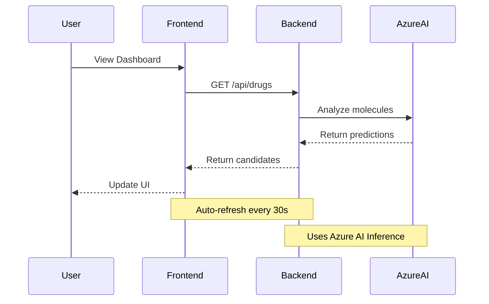

# Drug Development Platform Frontend 🧬

## Overview 🎯
This Next.js application provides an interactive interface for our AI-powered drug development platform. It showcases real-time monitoring of drug candidates and clinical trials using Azure AI Foundry SDKs.

## Features ✨
- 🔄 Real-time data refresh with automatic polling
- 🎨 Dark/Light theme support with smooth transitions
- 💡 Interactive tooltips for better understanding
- 📊 Live monitoring of clinical trials
- 🧪 AI-powered drug candidate analysis
- 🔍 Detailed metrics visualization

## Architecture 🏗️



## Getting Started 🚀

1. **Install Dependencies**:
   ```bash
   npm install
   ```

2. **Set Up Environment**:
   - Copy `.env.example` to `.env.local`
   - Update with your backend URL:
   ```env
   NEXT_PUBLIC_API_URL=http://localhost:8000
   ```

3. **Run Development Server**:
   ```bash
   npm run dev
   ```

4. **Access the Platform**:
   - Open [http://localhost:3000](http://localhost:3000)
   - Try the refresh button
   - Hover over metrics for tooltips

## Component Structure 🎨

### Drug Candidates Section
```tsx
// src/app/page.tsx
<Card className="col-span-2">
  <CardHeader>
    <CardTitle>🧬 Molecular Design</CardTitle>
  </CardHeader>
  <CardContent>
    {/* AI-powered drug analysis display */}
  </CardContent>
</Card>
```

### Clinical Trials Section
```tsx
// src/app/page.tsx
<Card className="col-span-2">
  <CardHeader>
    <CardTitle>🔬 Clinical Trials</CardTitle>
  </CardHeader>
  <CardContent>
    {/* Real-time trial monitoring */}
  </CardContent>
</Card>
```

## Data Refresh Implementation 🔄
The platform implements both automatic and manual refresh:

```typescript
// Auto-refresh every 30 seconds
useEffect(() => {
  const interval = setInterval(fetchData, 30000);
  return () => clearInterval(interval);
}, []);

// Manual refresh with loading state
const handleRefresh = async () => {
  setRefreshing(true);
  try {
    const data = await fetchData();
    setDrugCandidates(data);
  } finally {
    setRefreshing(false);
  }
};
```

## Theme Support 🌓
Built with next-themes and Tailwind CSS:
```tsx
const { theme, setTheme } = useTheme();
// Toggle between light/dark
<Button onClick={() => setTheme(theme === "dark" ? "light" : "dark")}>
  {theme === "dark" ? <Sun /> : <Moon />}
</Button>
```

## Technologies Used 🛠️
- Next.js 13+ with App Router
- TypeScript for type safety
- Tailwind CSS for styling
- ShadcnUI components
- Lucide React icons

## Contributing 🤝
1. Fork the repository
2. Create a feature branch
3. Submit a Pull Request

## Learn More 📚
- [Azure AI Foundry Documentation](https://learn.microsoft.com/azure/ai-foundry/)
- [Next.js Documentation](https://nextjs.org/docs)
- [Tailwind CSS](https://tailwindcss.com/docs)
- [ShadcnUI](https://ui.shadcn.com)
