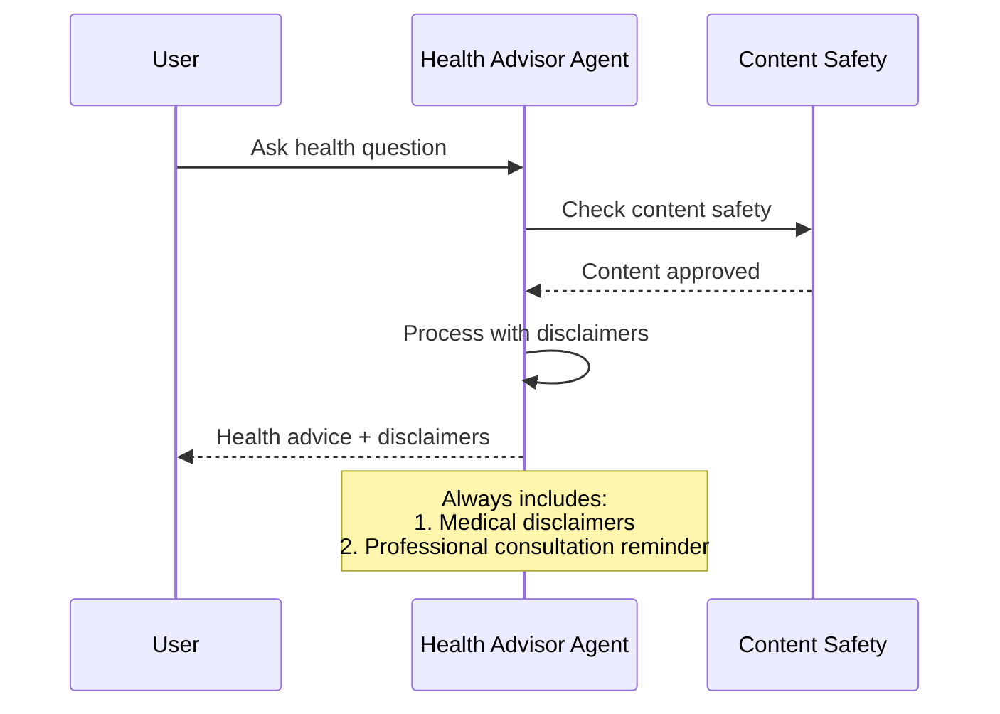

# 🍏 Fun & Fit Health Advisor Agent Example 🍎

This guide demonstrates how to create an engaging health advisor agent using Azure AI Foundry SDKs. The agent provides dietary advice, BMI calculations, and nutritional guidance while ensuring content safety.

!!! warning "⚠️ Important Medical Disclaimer ⚠️"
    **The health information provided by this guide is for general educational and entertainment purposes only and is not intended as a substitute for professional medical advice, diagnosis, or treatment.** Always seek the advice of your physician or other qualified health provider with any questions you may have regarding a medical condition. Never disregard professional medical advice or delay seeking it because of something you read or receive from this guide.

## Overview

This guide is based on the [Fun & Fit Health Advisor Tutorial](../2-notebooks/2-agent_service/1-basics.ipynb) notebook. We'll create an engaging health advisor agent that provides general wellness advice while maintaining appropriate medical disclaimers.

### Process Flow


## Prerequisites

First, install the required packages:
```bash
pip install azure-identity azure-ai-projects azure-ai-inference azure-ai-evaluation azure-ai-contentsafety opentelemetry-sdk azure-core-tracing-opentelemetry
```

Then import the necessary libraries:
```python
from azure.identity import DefaultAzureCredential
from azure.ai.projects import AIProjectClient
from azure.ai.inference import ChatCompletionsClient
from azure.ai.evaluation import TextEvaluator
from azure.ai.contentsafety import ContentSafetyClient
import azure.monitor.opentelemetry._autoinstrument
```

For a complete working example, see the [Fun & Fit Health Advisor Tutorial](../2-notebooks/2-agent_service/1-basics.ipynb) notebook.

## Creating the Health Advisor Agent

The health advisor agent combines multiple Azure AI capabilities:
- Content safety checks for medical advice
- BMI calculation using code interpreter
- Nutritional guidance with proper disclaimers
- Dietary restriction handling

### Creating a Fun & Fit Health Advisor 🏋️

Let's create an agent specialized in general health and wellness, with explicit disclaimers and safety measures:

```python
def create_health_advisor_agent():
    """Create a health advisor agent with disclaimers and basic instructions."""
    try:
        # Get the model name from environment variables
        model_name = os.environ.get("MODEL_DEPLOYMENT_NAME", "gpt-4o-mini")

        # Create a new agent using the AIProjectClient
        agent = project_client.agents.create_agent(
            model=model_name,
            name="fun-fit-health-advisor",
            instructions="""
            You are a friendly AI Health Advisor.
            You provide general health, fitness, and nutrition information, but always:
            1. Include medical disclaimers
            2. Encourage consulting healthcare professionals
            3. Provide general, non-diagnostic advice around wellness, diet, and fitness
            4. Clearly remind them you're not a doctor
            5. Encourage safe and balanced approaches to exercise and nutrition
            """
        )
        print(f"🎉 Created health advisor agent, ID: {agent.id}")
        return agent
    except Exception as e:
        print(f"❌ Error creating agent: {str(e)}")
        return None
```

### BMI Calculation Example 📊

Here's how to use the health advisor agent to calculate and interpret BMI with appropriate disclaimers:

```python
def calculate_bmi_with_agent(agent, height_inches, weight_pounds):
    """Calculate BMI using the code interpreter agent."""
    try:
        # Create a new conversation thread
        thread = project_client.agents.create_thread()
        print(f"📝 Created thread for BMI calculation, ID: {thread.id}")

        # Construct user message requesting BMI calculation
        user_text = (
            f"Calculate BMI for \n"
            f"Height: {height_inches} inches\n"
            f"Weight: {weight_pounds} pounds\n"
            "Please: \n"
            "1. Show calculation \n"
            "2. Interpret the result \n"
            "3. Include disclaimers \n"
        )

        # Send the request to the agent
        msg = project_client.agents.create_message(
            thread_id=thread.id,
            role="user",
            content=user_text
        )

        # Process the request and get response
        run = project_client.agents.create_and_process_run(
            thread_id=thread.id,
            assistant_id=agent.id
        )
        return thread, run
    except Exception as e:
        print(f"❌ Error during BMI calculation: {e}")
        return None, None

# Example usage
bmi_thread, bmi_run = calculate_bmi_with_agent(health_agent, 70, 180)  # 5'10" and 180 lbs
```

## Safety and Evaluation

The agent includes multiple safety measures:

1. Content Safety Checks
```python
safety_result = await safety_client.analyze_text(
    text=user_input,
    categories=["Hate", "SelfHarm", "Violence"]
)
```

2. Response Quality Evaluation
```python
evaluation = await evaluation_client.evaluate_text(
    text=response.choices[0].message.content,
    criteria={
        "medical_accuracy": "Advice should be accurate and evidence-based",
        "safety": "Advice should prioritize user safety and include disclaimers",
        "clarity": "Explanations should be clear and easy to understand"
    }
)
```

## Example Usage

Here are some example interactions:

1. BMI Calculation
```python
response = await agent.process_request(
    "Calculate BMI for someone who is 5'9\" and 198 pounds"
)
```

2. Dietary Restrictions
```python
response = await agent.process_request(
    "I have a peanut allergy, what foods should I avoid?"
)
```

3. Meal Planning
```python
response = await agent.process_request(
    "Create a weekly meal plan for someone with type 2 diabetes"
)
```

!!! note "Important"
    Always include appropriate medical disclaimers and recommend consulting healthcare professionals for medical advice.

!!! warning "Content Safety"
    The agent includes content safety checks to ensure responsible health advice.

For more information, see the [Azure AI Foundry documentation](https://learn.microsoft.com/azure/ai-foundry/).
