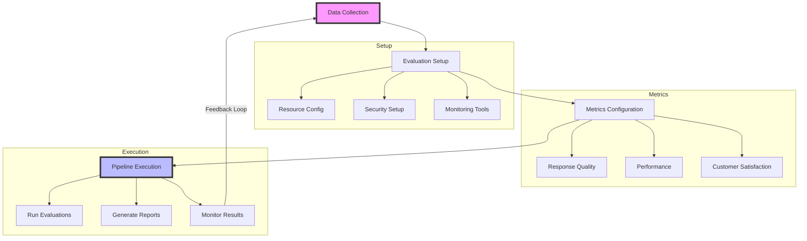

# Evaluating Your Customer Service Agent

Let's set up basic evaluation metrics to monitor your agent's performance. This will take about 15 minutes.

## Evaluation Pipeline Overview



## Quick Setup

```python
from azure.identity import DefaultAzureCredential
from azure.ai.evaluation import EvaluationClient
import os

class AgentEvaluator:
    def __init__(self):
        """Initialize the evaluation setup."""
        try:
            credential = DefaultAzureCredential()
            self.client = EvaluationClient(
                subscription_id=os.getenv("AZURE_SUBSCRIPTION_ID"),
                resource_group=os.getenv("AZURE_RESOURCE_GROUP"),
                credential=credential
            )
        except Exception as e:
            print(f"Setup error: {str(e)}")
            raise
    
    def configure_metrics(self):
        """Set up key customer service metrics."""
        try:
            metrics_config = {
                "response_quality": {
                    "relevance_score": True,
                    "completeness_score": True,
                    "accuracy_score": True
                },
                "performance": {
                    "response_time": True,
                    "success_rate": True
                },
                "customer_satisfaction": {
                    "resolution_rate": True,
                    "clarity_score": True
                }
            }
            
            # Apply configuration
            self.client.configure_metrics(metrics_config)
            return True
        except Exception as e:
            print(f"Metrics configuration error: {str(e)}")
            return False
    
    def evaluate_response(self, user_input: str, agent_response: str):
        """Evaluate a single agent response."""
        try:
            evaluation = self.client.evaluate_response(
                input_text=user_input,
                response_text=agent_response,
                metrics=["relevance", "completeness", "accuracy"]
            )
            return evaluation
        except Exception as e:
            print(f"Evaluation error: {str(e)}")
            raise

# Usage example
def main():
    evaluator = AgentEvaluator()
    evaluator.configure_metrics()
    
    # Example evaluation
    result = evaluator.evaluate_response(
        "How do I reset my password?",
        "To reset your password, click the 'Forgot Password' link..."
    )
    print("Evaluation results:", result)

if __name__ == "__main__":
    main()

```python
from azure.identity import DefaultAzureCredential
from azure.ai.evaluation import EvaluationClient
import json
import os
from typing import Dict, Any

class EvaluationSetup:
    def __init__(self):
        """Initialize the evaluation setup with Azure credentials."""
        try:
            self.credential = DefaultAzureCredential()
            self.client = EvaluationClient(
                subscription_id=os.getenv("AZURE_SUBSCRIPTION_ID"),
                resource_group=os.getenv("AZURE_RESOURCE_GROUP"),
                credential=self.credential
            )
        except Exception as e:
            print(f"Error initializing evaluation setup: {str(e)}")
            raise

    def configure_evaluation(self) -> Dict[str, Any]:
        """Configure evaluation settings with recommended defaults."""
        try:
            config = {
                "metrics": {
                    "response_quality": {
                        "weight": 0.3,
                        "threshold": 0.8
                    },
                    "response_relevance": {
                        "weight": 0.3,
                        "threshold": 0.7
                    },
                    "task_completion": {
                        "weight": 0.3,
                        "threshold": 0.9
                    },
                    "error_rate": {
                        "weight": 0.1,
                        "threshold": 0.1
                    }
                },
                "sampling": {
                    "method": "random",
                    "size": 1000,
                    "seed": 42
                },
                "evaluation_settings": {
                    "concurrent_evaluations": 5,
                    "timeout_seconds": 300,
                    "retry_attempts": 3
                }
            }
            
            # Save configuration
            with open("evaluation_config.json", "w") as f:
                json.dump(config, f, indent=2)
            
            return config
        except Exception as e:
            print(f"Error configuring evaluation: {str(e)}")
            raise

    def setup_monitoring(self):
        """Configure monitoring and alerting for evaluation."""
        try:
            monitoring_config = {
                "metrics_collection": {
                    "interval": "1m",
                    "retention_days": 30
                },
                "alerts": {
                    "error_rate_threshold": 0.2,
                    "latency_threshold_ms": 1000,
                    "notification_channels": ["email"]
                }
            }
            
            # Apply monitoring configuration
            self.client.configure_monitoring(monitoring_config)
            
            return True
        except Exception as e:
            print(f"Error setting up monitoring: {str(e)}")
            return False

# Example usage
if __name__ == "__main__":
    try:
        # Initialize setup
        setup = EvaluationSetup()
        
        # Configure evaluation
        config = setup.configure_evaluation()
        print("Evaluation configuration completed:")
        print(json.dumps(config, indent=2))
        
        # Setup monitoring
        monitoring_success = setup.setup_monitoring()
        if monitoring_success:
            print("Monitoring setup completed successfully")
        
    except Exception as e:
        print(f"Setup failed: {str(e)}")

### 2. Resource Configuration
- Compute resources
- Storage setup
- Network access
- Security settings
- Monitoring tools
- Logging system

### 3. Development Environment
- IDE setup
- SDK integration
- Testing tools
- Debugging utilities
- Documentation access
- Version control

## Evaluation Configuration

### 1. Project Setup
- Project creation
- Resource assignment
- Team access
- Security configuration
- Monitoring setup
- Backup planning

### 2. Metrics Configuration
- Performance metrics
- Quality metrics
- Resource metrics
- Cost metrics
- Security metrics
- Custom metrics

### 3. Test Data Management
- Data collection
- Data preparation
- Data validation
- Storage setup
- Access control
- Version management

## Tool Integration

### 1. SDK Integration
```python
def setup_sdk_integration():
    """Set up and configure SDK integration."""
    try:
        # Initialize client
        credential = DefaultAzureCredential()
        client = EvaluationClient(
            subscription_id=os.getenv("AZURE_SUBSCRIPTION_ID"),
            resource_group=os.getenv("AZURE_RESOURCE_GROUP"),
            credential=credential
        )
        
        # Configure SDK settings
        sdk_config = {
            "logging": {
                "level": "INFO",
                "format": "%(asctime)s - %(name)s - %(levelname)s - %(message)s",
                "handlers": ["file", "console"]
            },
            "error_handling": {
                "retry_enabled": True,
                "max_retries": 3,
                "backoff_factor": 2
            },
            "telemetry": {
                "enabled": True,
                "sampling_percentage": 100
            }
        }
        
        # Apply SDK configuration
        client.configure_sdk(sdk_config)
        
        # Set up logging
        import logging
        logging.basicConfig(
            level=logging.INFO,
            format=sdk_config["logging"]["format"],
            handlers=[
                logging.FileHandler("evaluation.log"),
                logging.StreamHandler()
            ]
        )
        
        return True
    except Exception as e:
        print(f"Error setting up SDK integration: {str(e)}")
        raise
```

### 2. Pipeline Configuration
```python
def configure_evaluation_pipeline():
    """Configure evaluation pipeline and workflow."""
    try:
        # Initialize client
        credential = DefaultAzureCredential()
        client = EvaluationClient(
            subscription_id=os.getenv("AZURE_SUBSCRIPTION_ID"),
            resource_group=os.getenv("AZURE_RESOURCE_GROUP"),
            credential=credential
        )
        
        # Define pipeline configuration
        pipeline_config = {
            "stages": [
                {
                    "name": "data_preparation",
                    "timeout_minutes": 30,
                    "retry_count": 2
                },
                {
                    "name": "model_evaluation",
                    "timeout_minutes": 60,
                    "retry_count": 1
                },
                {
                    "name": "results_analysis",
                    "timeout_minutes": 30,
                    "retry_count": 2
                }
            ],
            "triggers": [
                {
                    "type": "schedule",
                    "cron": "0 0 * * *"  # Daily at midnight
                },
                {
                    "type": "event",
                    "event_type": "ModelDeployment"
                }
            ],
            "error_handling": {
                "continue_on_error": False,
                "notification_channels": ["email"]
            },
            "reporting": {
                "format": "pdf",
                "schedule": "weekly",
                "recipients": ["team@domain.com"]
            }
        }
        
        # Apply pipeline configuration
        client.configure_pipeline(pipeline_config)
        
        return True
    except Exception as e:
        print(f"Error configuring pipeline: {str(e)}")
        raise
```

### 3. Monitoring Setup
```python
def setup_evaluation_monitoring():
    """Configure comprehensive monitoring for evaluation system."""
    try:
        # Initialize client
        credential = DefaultAzureCredential()
        client = EvaluationClient(
            subscription_id=os.getenv("AZURE_SUBSCRIPTION_ID"),
            resource_group=os.getenv("AZURE_RESOURCE_GROUP"),
            credential=credential
        )
        
        # Configure monitoring settings
        monitoring_config = {
            "metrics": {
                "collection_interval": "1m",
                "retention_days": 30,
                "custom_metrics": [
                    {
                        "name": "evaluation_success_rate",
                        "aggregation": "average",
                        "unit": "percent"
                    }
                ]
            },
            "alerts": [
                {
                    "name": "high_failure_rate",
                    "metric": "evaluation_failure_rate",
                    "threshold": 0.1,
                    "window_minutes": 15,
                    "action": "notify"
                }
            ],
            "dashboards": [
                {
                    "name": "Evaluation Overview",
                    "refresh_interval": "5m",
                    "widgets": [
                        "success_rate",
                        "latency",
                        "resource_usage"
                    ]
                }
            ],
            "logs": {
                "workspace_id": os.getenv("LOG_ANALYTICS_WORKSPACE_ID"),
                "retention_days": 30,
                "diagnostic_settings": {
                    "enabled": True,
                    "categories": ["Evaluation", "Pipeline", "Security"]
                }
            },
            "reporting": {
                "scheduled_reports": [
                    {
                        "name": "Weekly Performance",
                        "schedule": "0 0 * * 0",  # Weekly on Sunday
                        "format": "pdf",
                        "recipients": ["team@domain.com"]
                    }
                ],
                "export_format": "csv",
                "auto_export": True
            }
        }
        
        # Apply monitoring configuration
        client.configure_monitoring(monitoring_config)
        
        return True
    except Exception as e:
        print(f"Error setting up monitoring: {str(e)}")
        raise
```

## Security Configuration

### 1. Access Control
```python
def configure_access_control():
    """Configure access control and security settings."""
    try:
        # Initialize client
        credential = DefaultAzureCredential()
        client = EvaluationClient(
            subscription_id=os.getenv("AZURE_SUBSCRIPTION_ID"),
            resource_group=os.getenv("AZURE_RESOURCE_GROUP"),
            credential=credential
        )
        
        # Configure authentication settings
        auth_config = {
            "authentication": {
                "type": "aad",
                "tenant_id": os.getenv("AZURE_TENANT_ID"),
                "required_roles": ["AI.Evaluator", "AI.Admin"]
            },
            "authorization": {
                "role_assignments": [
                    {
                        "role": "AI.Evaluator",
                        "scope": "project",
                        "assignees": ["user@domain.com"]
                    }
                ],
                "custom_roles": [
                    {
                        "name": "EvaluationViewer",
                        "permissions": ["read", "execute"]
                    }
                ]
            },
            "audit": {
                "logging_enabled": True,
                "log_retention_days": 90,
                "detailed_logging": True
            }
        }
        
        # Apply configuration
        client.security.configure_access_control(auth_config)
        
        return True
    except Exception as e:
        print(f"Error configuring access control: {str(e)}")
        raise
```

### 2. Data Protection
```python
def setup_data_protection():
    """Configure data protection and compliance settings."""
    try:
        # Initialize client
        credential = DefaultAzureCredential()
        client = EvaluationClient(
            subscription_id=os.getenv("AZURE_SUBSCRIPTION_ID"),
            resource_group=os.getenv("AZURE_RESOURCE_GROUP"),
            credential=credential
        )
        
        # Configure data protection
        protection_config = {
            "encryption": {
                "type": "CustomerManaged",
                "key_vault_id": os.getenv("KEY_VAULT_ID"),
                "key_name": "evaluation-key",
                "auto_rotation_enabled": True
            },
            "access_policies": {
                "data_access": "RoleBasedAccessControl",
                "minimum_tls_version": "1.2",
                "allowed_ip_ranges": ["10.0.0.0/24"]
            },
            "backup": {
                "enabled": True,
                "frequency": "Daily",
                "retention_days": 30,
                "geo_redundant": True
            },
            "compliance": {
                "data_classification": "Confidential",
                "retention_policy": "1Year",
                "audit_enabled": True
            }
        }
        
        # Apply configuration
        client.security.configure_data_protection(protection_config)
        
        return True
    except Exception as e:
        print(f"Error setting up data protection: {str(e)}")
        raise
```

### 3. Network Security
```python
def configure_network_security():
    """Configure network security and monitoring."""
    try:
        # Initialize client
        credential = DefaultAzureCredential()
        client = EvaluationClient(
            subscription_id=os.getenv("AZURE_SUBSCRIPTION_ID"),
            resource_group=os.getenv("AZURE_RESOURCE_GROUP"),
            credential=credential
        )
        
        # Configure network security
        network_config = {
            "network": {
                "virtual_network_id": os.getenv("VNET_ID"),
                "subnet_id": os.getenv("SUBNET_ID"),
                "private_endpoint_enabled": True
            },
            "firewall": {
                "rules": [
                    {
                        "name": "allow-internal",
                        "priority": 100,
                        "action": "Allow",
                        "source_addresses": ["10.0.0.0/16"]
                    }
                ],
                "ddos_protection_enabled": True
            },
            "monitoring": {
                "traffic_analytics_enabled": True,
                "flow_logs_enabled": True,
                "retention_days": 30,
                "alerts": [
                    {
                        "name": "high-traffic",
                        "metric": "BytesTransferred",
                        "threshold": 1000000,
                        "window_minutes": 5
                    }
                ]
            },
            "threat_protection": {
                "enabled": True,
                "scan_level": "High",
                "email_notifications": True,
                "incident_response": {
                    "auto_remediation": True,
                    "notification_channels": ["email", "webhook"]
                }
            }
        }
        
        # Apply configuration
        client.security.configure_network_security(network_config)
        
        return True
    except Exception as e:
        print(f"Error configuring network security: {str(e)}")
        raise
```

## Best Practices

### 1. Environment Management
- Resource optimization
- Cost monitoring
- Performance tuning
- Security hardening
- Documentation
- Team training

### 2. Data Management
- Data organization
- Version control
- Access management
- Backup strategy
- Recovery procedures
- Compliance monitoring

### 3. Operational Excellence
- Process automation
- Quality control
- Performance monitoring
- Security maintenance
- Documentation updates
- Knowledge sharing

## Interactive Workshop

To get hands-on experience with performance metrics and evaluation setup, we've prepared an interactive Jupyter notebook that will guide you through:
- Defining custom evaluation metrics
- Setting up comprehensive test cases
- Running performance evaluations
- Analyzing and visualizing results
- Implementing optimization recommendations

[Launch Performance Metrics Workshop](../2-notebooks/3-quality_attributes/2-evaluation.ipynb)

This notebook provides a practical implementation of performance metrics evaluation. You'll work directly with the Azure AI Evaluation SDK to measure and optimize your customer service agent's performance.

Next: [Evaluating Agents](agent.md)
