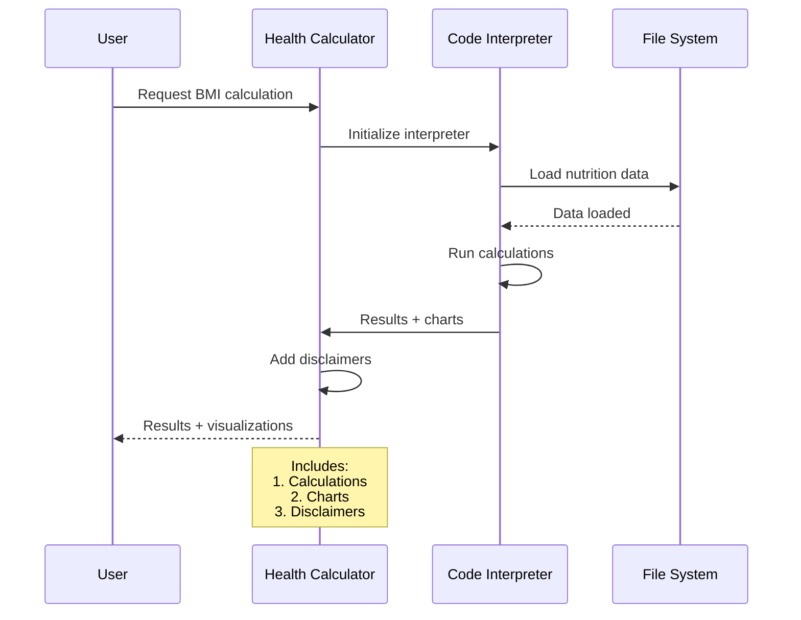

---
markdown_extensions:
  - pymdownx.highlight:
      anchor_linenums: true
  - pymdownx.superfences
  - admonition
  - def_list
  - pymdownx.details
---

# 🥗 Dietary Planning with Azure AI 🥑

This guide demonstrates how to implement dietary planning scenarios using Azure AI Foundry's latest SDKs, with a focus on using the Code Interpreter tool for nutrition analysis and BMI calculations.

!!! warning "⚠️ Important Medical Disclaimer ⚠️"
    **The dietary information provided by this guide is for general educational and entertainment purposes only and is not intended as a substitute for professional medical advice, diagnosis, or treatment.** Always seek the advice of your physician or other qualified health provider with any questions you may have regarding dietary needs or restrictions.

!!! note "SDK Updates"
    This guide uses the latest Azure AI SDKs:
    ```python
    from azure.ai.projects import AIProjectClient
    from azure.ai.inference import ChatCompletionsClient
    ```

## Creating a Health Calculator with Code Interpreter 🧮

Let's create an agent that can perform health calculations and analyze nutritional data using the Code Interpreter tool. Here's how the process works:



```python
def create_health_calculator(file_path):
    """Create an agent with code interpreter for health/nutrition calculations."""
    try:
        # Upload nutrition data file for analysis
        uploaded_file = project_client.agents.upload_file_and_poll(
            file_path=file_path,
            purpose=FilePurpose.AGENTS
        )
        print(f"✅ Uploaded CSV file, ID: {uploaded_file.id}")

        # Create a Code Interpreter tool referencing the uploaded file
        code_tool = CodeInterpreterTool(file_ids=[uploaded_file.id])

        # Create the agent with instructions to do basic calculations
        agent = project_client.agents.create_agent(
            model=os.environ.get("MODEL_DEPLOYMENT_NAME", "gpt-4o-mini"),
            name="health-calculator-agent",
            instructions="""
            You are a health calculator agent that can:
            1. Calculate and interpret BMI
            2. Analyze provided nutrition data
            3. Generate charts/plots
            4. Include disclaimers that you are not a medical professional
            """,
            tools=code_tool.definitions,
            tool_resources=code_tool.resources
        )
        print(f"🎉 Created health calculator agent, ID: {agent.id}")
        return agent, uploaded_file
    except Exception as e:
        print(f"❌ Error creating health calculator agent: {e}")
        return None, None
```

## Nutrition Analysis with Code Interpreter 📊

The Code Interpreter tool can analyze nutrition data and create visualizations:

```python
def analyze_nutrition_data(agent):
    """Ask the agent to analyze the uploaded nutrition data."""
    try:
        # Create a new conversation thread
        thread = project_client.agents.create_thread()
        print(f"📝 Created thread for nutrition analysis, ID: {thread.id}")

        # Request nutrition analysis with visualization
        user_text = (
            "Analyze the CSV file with daily nutrition data.\n"
            "1. Compute average daily macros (calories, protein, carbs, fat, fiber).\n"
            "2. Create a chart to show trends.\n"
            "3. Discuss any insights or disclaimers.\n"
        )

        # Send request to agent
        msg = project_client.agents.create_message(
            thread_id=thread.id,
            role="user",
            content=user_text
        )

        # Process request and get response with charts
        run = project_client.agents.create_and_process_run(
            thread_id=thread.id,
            assistant_id=agent.id
        )
        return thread, run
    except Exception as e:
        print(f"❌ Error analyzing nutrition data: {e}")
        return None, None

# Example usage
nutrition_thread, nutrition_run = analyze_nutrition_data(health_agent)

??? example "Meal Planning"
    ```python
    response = chat_client.complete(
        model=model_name,
        messages=[
            {"role": "system", "content": "You are a nutritionist creating healthy meal plans."},
            {"role": "user", "content": "Create a balanced meal plan for diabetes"}
        ]
    )
    ```

??? example "Dietary Restrictions"
    ```python
    response = chat_client.complete(
        model=model_name,
        messages=[
            {"role": "system", "content": "You are a dietary advisor."},
            {"role": "user", "content": "What foods should I avoid with celiac disease?"}
        ]
    )
    ```

## Viewing Results & Visualizations 📊

After running the nutrition analysis, you can view the agent's responses and any generated charts:

```python
def view_agent_responses(thread_id):
    """Display agent responses and save any generated charts."""
    try:
        # Get all messages in the thread
        messages = project_client.agents.list_messages(thread_id=thread_id)
        print("\n🔎 Agent Responses:")
        
        # Display text responses
        for msg in messages.data:
            if msg.role == "assistant" and msg.content:
                for c in msg.content:
                    if hasattr(c, "text"):
                        print("Response:", c.text.value, "\n")

        # Save any generated charts
        for img in messages.image_contents:
            file_id = img.image_file.file_id
            outname = f"chart_{file_id}.png"
            project_client.agents.save_file(file_id=file_id, file_name=outname)
            print(f"🖼️ Saved image output: {outname}")

    except Exception as e:
        print(f"❌ Error viewing agent responses: {e}")

# View BMI calculation results
if bmi_thread and bmi_run:
    print("\n=== BMI Calculation Results ===")
    view_agent_responses(bmi_thread.id)

# View nutrition analysis results
if nutrition_thread and nutrition_run:
    print("\n=== Nutrition Analysis Results ===")
    view_agent_responses(nutrition_thread.id)
```

For a complete working example with sample data and visualizations, see the [Health Calculator Tutorial](../2-notebooks/2-agent_service/2-code_interpreter.ipynb) notebook.

## Content Safety & Best Practices

When working with health-related AI agents:

1. **Data Handling**
   - Validate input data
   - Handle missing values appropriately
   - Properly manage file attachments

2. **Calculations**
   - Show formula steps
   - Include medical disclaimers
   - Limit scope to general wellness
   - Remind users you're not a medical professional

3. **Visualizations**
   - Use clear labeling
   - Include disclaimers on charts
   - Explain that visualizations are for educational purposes

4. **Security**
   - Monitor agent usage
   - Implement content safety checks:
   ```python
   from azure.ai.contentsafety import ContentSafetyClient
   
   safety_client = ContentSafetyClient(
       endpoint=os.getenv("AZURE_CONTENTSAFETY_ENDPOINT"),
       credential=credential
   )
   
   safety_result = await safety_client.analyze_text(
       text=user_input,
       categories=["Hate", "SelfHarm", "Violence"]
   )
   ```

## Response Evaluation

Use the TextEvaluator to assess dietary advice quality:

```python
from azure.ai.evaluation import TextEvaluator

evaluator = TextEvaluator(credential=credential)
evaluation = await evaluator.evaluate_text(
    text=response.choices[0].message.content,
    criteria={
        "medical_accuracy": "Advice should be accurate and evidence-based",
        "safety": "Advice should include appropriate disclaimers",
        "clarity": "Explanations should be clear and easy to understand"
    }
)
```

## Best Practices

1. Always include health disclaimers
2. Validate nutritional information
3. Consider dietary restrictions
4. Monitor response quality
5. Implement safety checks

!!! tip "Monitoring"
    Use Azure Monitor OpenTelemetry for tracking:
    ```python
    import azure.monitor.opentelemetry._autoinstrument
    ```

For more examples and detailed documentation, see the [Azure AI Foundry documentation](https://learn.microsoft.com/azure/ai-foundry/).
