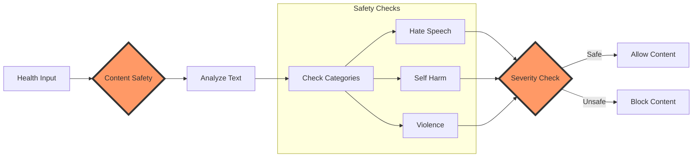

# 🛡️ Azure AI Content Safety SDK Tutorial

Learn how to implement content safety checks for health and medical advice. Keep your health recommendations safe and reliable! ⚕️ 🔒

## Safety Check Flow



## Prerequisites
```python
from azure.identity import DefaultAzureCredential
from azure.ai.contentsafety import ContentSafetyClient
```

## Getting Started
Initialize the safety client:
```python
client = ContentSafetyClient(
    endpoint=os.getenv("AZURE_CONTENTSAFETY_ENDPOINT"),
    credential=DefaultAzureCredential()
)
```

## Safety Checks Example
Analyze health advice for safety:
```python
safety_result = await client.analyze_text(
    text=user_input,
    categories=["Hate", "SelfHarm", "Violence"]
)

if any(category.severity > 2 for category in safety_result.categories):
    print("Content requires review for safety concerns")
```

## Next Steps
- Try the [Content Safety Tutorial Notebook](../2-notebooks/1-chat_completion/3-basic-rag.ipynb)
- Learn about [Azure AI Evaluation](evaluation.md)
- Explore [Azure Monitor](monitoring.md)

!!! note "Notebook Tutorial"
    The complete tutorial notebook is available in the Notebooks section under SDK Tutorials.
