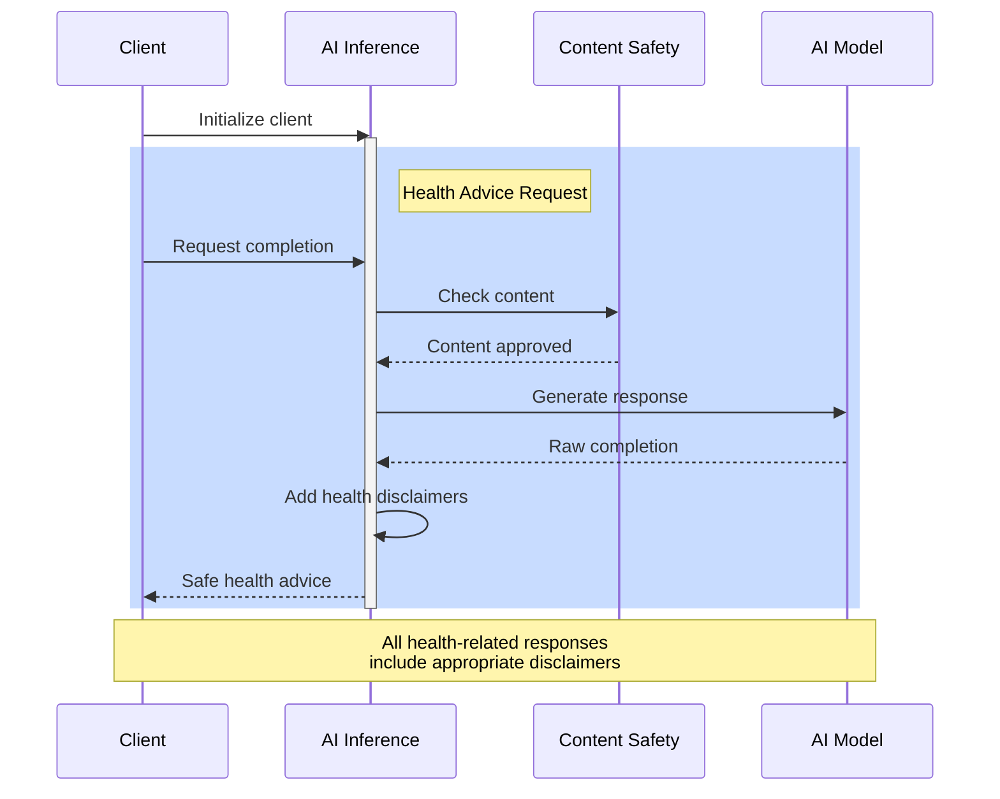

# 🤖 Azure AI Inference SDK Tutorial

This tutorial demonstrates how to use the Azure AI Inference SDK for generating health and dietary advice. Let's build some intelligent health recommendations! 🏃‍♂️ 🥗

## Process Flow



## Prerequisites
```python
from azure.identity import DefaultAzureCredential
from azure.ai.inference import ChatCompletionsClient
```

## Getting Started
Initialize the chat client for health advice:
```python
client = ChatCompletionsClient(
    endpoint=os.getenv("AZURE_OPENAI_ENDPOINT"),
    credential=DefaultAzureCredential()
)
```

## Health Advice Example
Generate personalized health recommendations:
```python
response = await client.complete(
    model="gpt-4",
    messages=[
        {"role": "system", "content": "You are a health advisor providing evidence-based advice."},
        {"role": "user", "content": "Create a balanced meal plan for diabetes"}
    ],
    temperature=0.7
)
print(response.choices[0].message.content)
```

## Next Steps
- Try the [Inference Tutorial Notebook](../2-notebooks/1-chat_completion/2-embeddings.ipynb)
- Learn about [Azure AI Evaluation](evaluation.md)
- Explore [Azure Monitor](monitoring.md)

!!! note "Notebook Tutorial"
    The complete tutorial notebook is available in the Notebooks section under SDK Tutorials.
