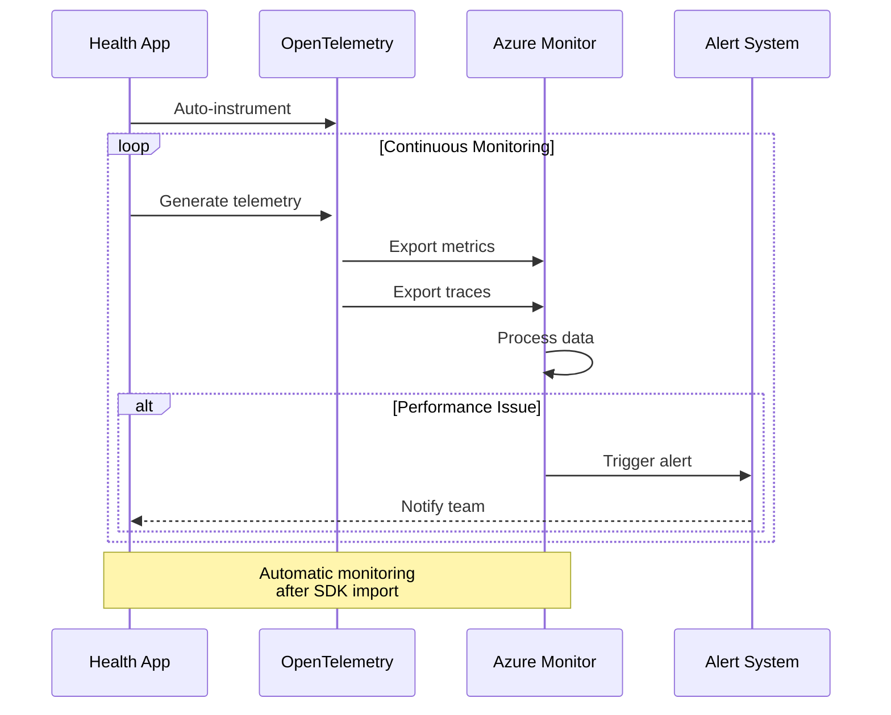

# 📊 Azure Monitor OpenTelemetry Tutorial

Learn how to monitor health advice applications using Azure Monitor OpenTelemetry. Keep your health advisor running smoothly! 🏥 📈

## Telemetry Flow



## Prerequisites
```python
# Import required packages
from azure.identity import DefaultAzureCredential
import azure.monitor.opentelemetry._autoinstrument
from opentelemetry import trace
from opentelemetry.sdk.trace import TracerProvider
from azure.core.tracing.opentelemetry import AzureMonitorTraceExporter

# Set up OpenTelemetry tracing
tracer_provider = TracerProvider()
trace.set_tracer_provider(tracer_provider)

# Configure Azure Monitor exporter
exporter = AzureMonitorTraceExporter(
    connection_string="your_connection_string"  # Set this in your environment
)
```

## Getting Started
The OpenTelemetry instrumentation is automatically set up when imported.

## Monitoring Example
Monitor health advice operations:
```python
# Monitoring is automatic after import
# You can view metrics in Azure Monitor
```

## Next Steps
- Try the [Monitoring Tutorial Notebook](../2-notebooks/3-quality_attributes/1-Observability.ipynb)
- Learn about [Azure AI Projects](projects.md)
- Explore [Azure AI Inference](inference.md)

!!! note "Notebook Tutorial"
    The complete tutorial notebook is available in the Notebooks section under SDK Tutorials.
